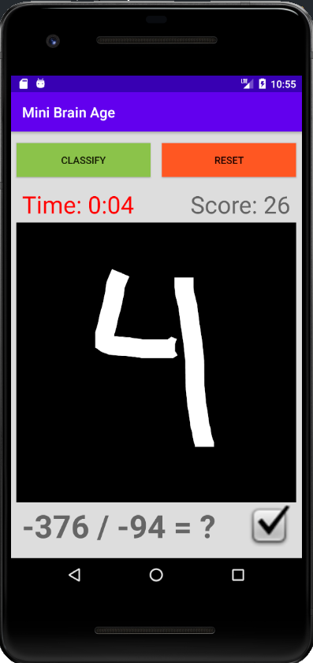

# Mini Brain Age

Inspired by Brain Age, this Android game tests players' math knowledge by hand drawing numbers and quickly solving math problems. A key feature of this app is that it uses on-device machine learning to interpret the handwritten digits. This is done by feeding the MNIST dataset into a neural network created in TensorFlow Lite.

## How to Run

Clone this repo and run it in Android Studio.
