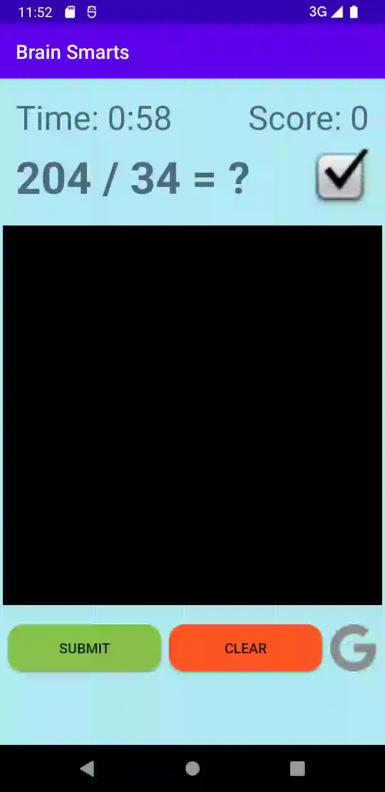

# Brain Smarts

<a target="_blank" rel="noopener noreferrer" href="https://play.google.com/store/apps/details?id=com.abhi.minibrainage&pcampaignid=pcampaignidMKT-Other-global-all-co-prtnr-py-PartBadge-Mar2515-1">
    
</a>



Inspired by Brain Age, this Android game tests players' math knowledge by hand drawing numbers and quickly solving math problems. With a Play Games account, players can upload their high scores to the leaderboards.

A key feature of this app is that it uses on-device machine learning to interpret handwritten digits. This is done by feeding the MNIST dataset into a neural network created in TensorFlow Lite.

## The Neural Network

The neural network was created using Keras and its design is based on the [LeNet](https://www.kaggle.com/blurredmachine/lenet-architecture-a-complete-guide) convolutional architecture for handwritten character recognition. The following describes each layer:
- Input: 1x28x28
- Conv1: 1x28x28 input, 32 3x3 filters → 32x26x26 output (ReLU activation)
- Conv2: 32x26x26 input, 64 3x3 filters → 64x24x24 output (ReLU activation)
- MaxPool: 64x24x24 input, 2x2 filter, stride 2 → 64x12x12 output
- Dropout: 25%
- Flatten: 64x12x12 input → 9216 layers
- Dense: 9216 layers → 10 layers (softmax activation)

Because players can draw anywhere on the canvas, data augmentation was used to improve the accuracy of the model—namely rotation, width & height shift, shear, and zoom. The model was trained for 5 epochs and was compressed to a TFLite file using quantization.

## How to Run

To run the app, [clone](https://github.com/Abhiek187/MiniBrainAge.git) this repo and run it in Android Studio.

There are 3 Python files that can be executed after installing the [TensorFlow module](https://www.tensorflow.org/install/pip):

- `train_ml_model.py` creates the initial MNIST neural network with 98% accuracy
- `improve_accuracy.py` utilizes data augmentation to improve the accuracy on mobile devices
- `write_metadata.py` generates info about the tflite file that can be viewed on code generators, such as Android Studio's ML Binding

`write_metadata.py` is executed with the following syntax:
```
python3 ./write_metadata.py \
    --model_file=./<path-to>/mnist.tflite \
    --label_file=./labels.txt \
    --export_directory=<output-directory>
```

---
<sup>Google Play and the Google Play logo are trademarks of Google LLC.</sup>
